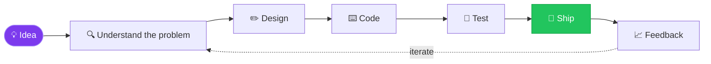

<!-- ================= HEADER ================= -->


<div align="center">

<a href="https://git.io/typing-svg">
  
</a>

<br/>

<a href="https://www.linkedin.com/in/kevin-lopes-151797221/"></a>
<a href="https://wa.me/5514997922151"></a>
<a href="mailto:kevinlopesdemorais@gmail.com"></a>


</div>

---

<!-- ================= TERMINAL ================= -->
<h2>🖥️ <code>~/kevin</code></h2>


<!-- ================= ABOUT AS CODE ================= -->
<h2>🧬 About me</h2>

```ts
const kevin = {
  role: "Full Stack Developer",
  education: "Bachelor of Computer Science 🎓",
  location: "Brazil 🇧🇷",
  frontend: ["React", "Angular", "TypeScript", "Sass", "Flutter"],
  backend: ["C# / .NET", "Python", "Node.js"],
  data: ["MySQL", "Firebase"],
  cloud: ["AWS"],
  tools: ["Git", "GitLab", "Jira", "Jest", "npm"],
  mindset: "Learn → Build → Ship → Repeat",
  askMeAbout: ["web apps", "APIs", "clean code", "coffee ☕"],
};
```

<!-- ================= HOW I WORK (Mermaid) ================= -->
<h2>🧠 How I build things</h2>



<!-- ================= STACK ================= -->
<h2>⚡ Tech stack</h2>

<div align="center">
  
</div>

<!-- ================= 3D CONTRIBUTIONS ================= -->
<h2>🌌 My contributions in 3D</h2>


<!-- ================= STATS ================= -->
<h2>📊 GitHub stats</h2>

<div align="center">
  
  
  <br/>
  
</div>

<details>
<summary><b>🏆 Click to see my trophies</b></summary>
<br/>
<div align="center">

</div>
</details>

<details>
<summary><b>🎲 Random dev quote</b></summary>
<br/>
<div align="center">

</div>
</details>

<!-- ================= SNAKE (auto light/dark) ================= -->
<h2>🐍 Eating my contributions</h2>

<picture>
  <source media="(prefers-color-scheme: dark)" srcset="https://raw.githubusercontent.com/KevinLopes23/KevinLopes23/output/snake-dark.svg" />
  <source media="(prefers-color-scheme: light)" srcset="https://raw.githubusercontent.com/KevinLopes23/KevinLopes23/output/snake.svg" />
  
</picture>

<!-- ================= FOOTER ================= -->

